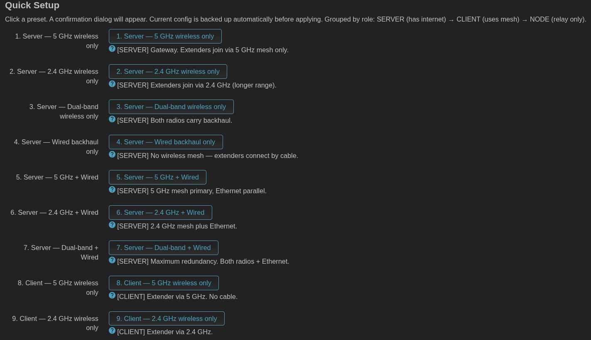
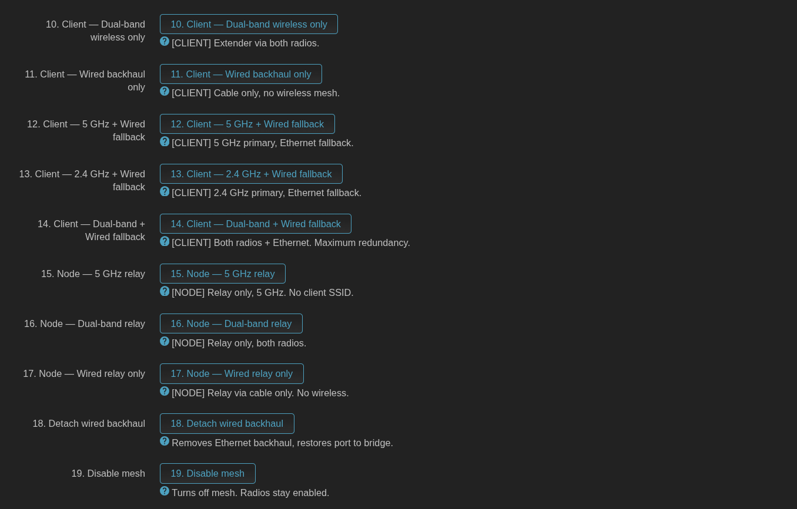
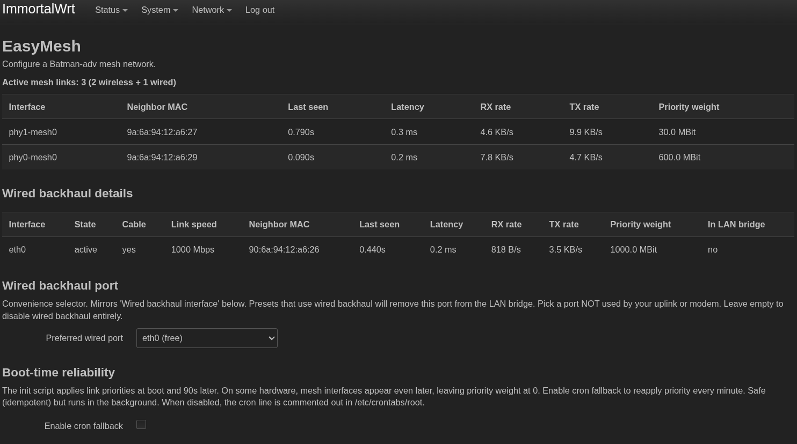
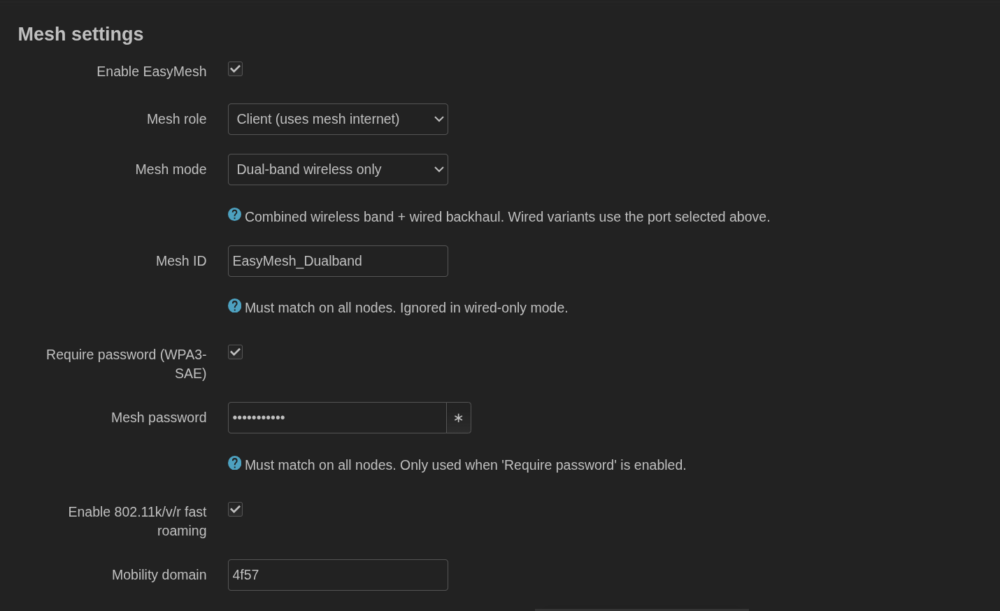
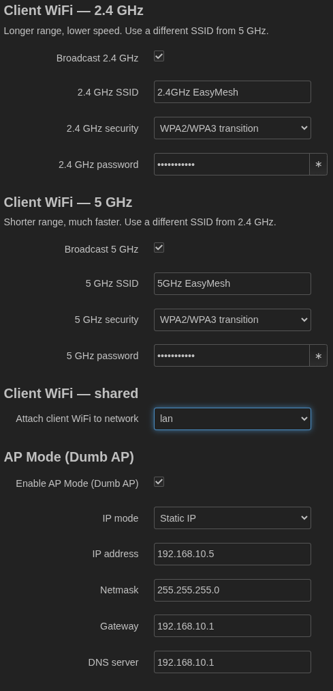
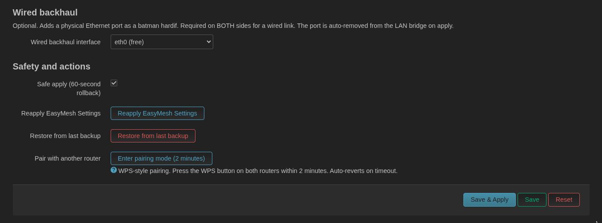
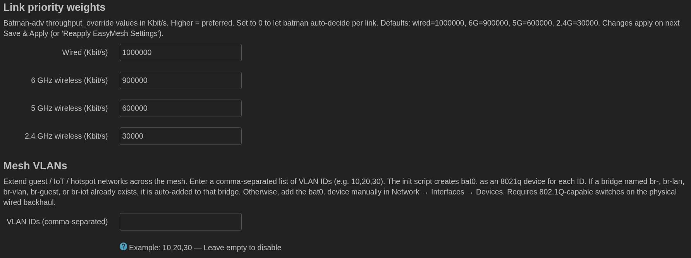

🌐 **English** · [**বাংলা**](https://github.com/arafatrahmanzami/luci-app-easymesh/tree/main/docs/bn)

# luci-app-easymesh

An EasyMesh plugin for OpenWrt/ImmortalWrt — a lightweight Linux LuCI (OpenWrt's web-based configuration User Interface) interface that simplifies deploying Batman-adv layer-2 mesh networks with 802.11s (IEEE WiFi mesh standard) wireless and wired backhaul. It can also be used standalone without a hotspot or VPN (Virtual Private Network).

**Release:** `2.4.1-r1` — 2026-09-16 — by [@arafatrahmanzami](https://github.com/arafatrahmanzami)

With limited skills, I wrote a mesh LuCI setup plugin based on `kmod-batman-adv` + 802.11s wired + wireless backhaul. The addition of quick and automatic settings makes setup more convenient. The plugin has only been tested on OpenWrt and ImmortalWrt 24 and 25. It's very poorly written but usable for now. Please report or resolve any issues with the available source code if needed.

---

## What does this actually do?

Imagine you have two or more WiFi routers. Normally they create **separate** WiFi networks — your phone has to disconnect and reconnect when you walk between rooms.

**EasyMesh** makes them behave as **one single WiFi network**. Your phone stays connected as you move around the house — no drops, no reconnections.

It also lets you **connect the routers with Ethernet cables** for faster backhaul. The mesh uses the cable when possible, wireless when the cable isn't available, and switches between them automatically.

**You need this if:**

- ✅ You have 2+ routers running OpenWrt / ImmortalWrt
- ✅ You want one seamless WiFi name across the whole house
- ✅ You want to extend WiFi into a far room without losing performance
- ✅ You have a guest network you want to reach everywhere

**You don't need this if:**

- ❌ You have only one router
- ❌ You don't want to install custom firmware
- ❌ You're happy with separate WiFi names per router

---

## Table of Contents

- [What does this actually do?](#what-does-this-actually-do)
- [Why EasyMesh?](#why-easymesh)
- [Key Features](#key-features)
- [Prerequisites](#prerequisites)
- [Before You Start](#before-you-start)
- [Installation](#installation)
- [After Installation](#after-installation)
- [Quick Start](#quick-start)
- [Detailed Setup](#detailed-setup--basic-mesh-network-1-server--2-nodes)
- [Working with Dumb AP / Client Nodes](#working-with-dumb-ap--client-nodes)
- [Tuning Link Priorities](#tuning-link-priorities)
- [Wired Backhaul — Safety, Fallback & Actions](#wired-backhaul--safety-fallback--actions)
- [Extending Guest / IoT Networks over the Mesh (VLANs)](#extending-guest--iot-networks-over-the-mesh-vlans)
- [More Info — Use Case Scenarios](#more-info--use-case-scenarios)
- [Troubleshooting](#troubleshooting)
- [Changelog](#changelog)
- [Compile from Source](#compile-from-source-openwrt-sdk)
- [Credits](#credits)
- [Glossary](#glossary)
- [License](#license)

---

## Why EasyMesh?

This is the first fork of the official EasyMesh release. It simplifies deploying and configuring Batman-adv layer-2 mesh networks with wired and/or wireless backhaul, and provides an easy-to-use LuCI interface for configuring mesh servers and client nodes in seconds.

Whether you're extending Hotspot / VPN LAN + WiFi coverage with "OpenLink Captive Portal" or WireGuard, building a seamless home mesh network, or managing multiple nodes across a homelab setup, EasyMesh is built to make Batman-adv mesh WiFi deployment super-fast and effortless.

It also makes it faster and easier to deploy an advanced wired + WiFi mesh for extending the range of a Hotspot, with seamless integration with WireGuard / TorGuard's WireGuard apps using OpenWrt/ImmortalWrt `OpenLink-Captive-Portal`, `wireguard` / `torguardvpn`, powered by `batman-adv` (Batman-adv = Better Approach To Mobile Adhoc Networking — Advanced).

**EasyMesh is ideal for:**

- ✅ One-click setup/deployment for a pure mesh on OpenWrt — simplifies server and client-node configuration inside the LuCI web interface
- ✔ Deploying a server/client wired + WiFi mesh backhaul network in seconds with OpenWrt/ImmortalWrt & Batman-adv for access-point WiFi and mesh networks
- ✔ Extending / enhancing connectivity with multiple nodes over WiFi or Ethernet with VPN / Hotspot coverage over large areas
- ✔ Simplifying homelab setups behind WireGuard for managing devices across locations

---

## Key Features

- **Mesh core:** Batman-adv 802.11s mesh with dual-band + wired backhaul fallback and loop prevention (available on both Server and Client roles)
- **Split-band client SSIDs** (Service Set Identifiers — the WiFi network names; split-band prevents sticky-2.4 GHz clients)
- **Backhaul support:** combines `kmod-batman-adv` and 802.11s for mixed wired and wireless connections
- **Wired backhaul port handling:** port is automatically removed from the LAN bridge on apply
- **Link priority:** wired → 6 GHz → 5 GHz → 2.4 GHz (`throughput_override`)
- **GUI-editable link priority weights** — no hardcoded values; tune each band's weight directly in the UI
- **Bonding enabled** for simultaneous multi-link traffic
- **Auto band detection** (frequency-based, works on any radio order)
- **Security:** WPA3 authentication for secure networks, or open networks
- **WPS / mode-button pairing** via `/etc/rc.wps/` dispatcher
- **60-second rollback watchdog** for IP changes
- **AP Mode (Dumb AP)** for client nodes — Dumb AP Mesh Client/Slave nodes can also provide Internet access via their LAN ports
- **Built-in Mesh Status dashboard** — view Neighbor Nodes, Last Seen Time, Interfaces, and more
- **Live RX/TX latency and bandwidth/link-speed** monitoring for wireless and wired links and peers (smoothed over 3 pings)
  - Note: not purely live field updates yet — a page refresh is needed
- **Priority Weight column** displayed for wireless peers (previously only wired)
- **Neighbor MAC + last-seen** for wired backhaul (from the batman originator table)
- **Mesh VLANs** — extend guest / IoT / hotspot networks across the mesh via 802.1Q
- **Auto firewall & interface configuration** for servers and clients
- **Flexible node addressing:** DHCP (Dynamic Host Configuration Protocol), Static IP, and Dumb AP modes
- **Roaming optimization:** integrates 802.11k/v/r (fast-roaming standards) with `dawn` / `usteer` daemon support for fast client roaming between access points
  - Advanced K/V/R settings + Mobility Domain
  - Using one of `dawn` or `usteer` via their respective luci-apps significantly reduces latency when switching between devices/applications
- **Hotplug + init + optional cron fallback** for link priority
- **VPN compatibility:** easy integration with TorGuard's WireGuard and other VPN OpenWrt apps for VPN-based mesh networks
- **Variants:** openssl / wolfssl / mbedtls

---

## Prerequisites

To function correctly, the app generally requires the following underlying packages:

- OpenWrt / ImmortalWrt 24.10+
- `kmod-batman-adv`, `batctl-default`, `luci-proto-batman-adv`, `kmod-cfg80211` (kernel module loaded)
- One of `wpad-mesh-openssl` / `wpad-mesh-wolfssl` / `wpad-mesh-mbedtls` (for WPA3 encryption)
- One of `dawn` / `usteer` (for AP steering / fast roaming)
- `luci-compat` (if encountering missing Lua runtime dependencies)

**Hardware requirements:** routers/devices with wireless network cards that support 802.11s mesh (such as MediaTek MT76, Qualcomm Atheros, etc.).

---

## Before You Start

Answer these five questions **before** installing:

- [ ] **Do I have 2+ routers running OpenWrt or ImmortalWrt?** — If no, this app won't help yet. Install OpenWrt first.
- [ ] **Do I know my router's IP address?** — Usually `192.168.1.1` or `192.168.10.1`. Check your phone's WiFi settings under "Router" or "Gateway".
- [ ] **Do I have SSH access?** — Try `ssh root@<router-ip>` from your PC. Password is the same as LuCI login.
- [ ] **Do I have a working internet connection on my main router?** — The install downloads packages.
- [ ] **Have I backed up my current config?** — In LuCI: **System → Backup / Flash Firmware → Generate archive**. Do this on every router.

If all five are ✅, proceed. If any is ❌, fix that first.

---

## Installation

Run these entirely from `/tmp` — nothing clutters the root filesystem.

**No architecture detection needed.** EasyMesh is `PKG_ARCH=all` — works on every router CPU (x86, MIPS, ARM, AArch64, RISC-V).

You can quickly build a completely standard mesh wireless network using only OpenWrt/ImmortalWrt.

### 1. Check wpad — do you need a specific wpad variant?

EasyMesh requires a **mesh-capable wpad** (Wireless Protected Access Daemon) to create the 802.11s backhaul. Most routers already have one installed. Check first:

```sh
# On the router — run this before installing EasyMesh
opkg list-installed 2>/dev/null | grep wpad
# or for OpenWrt 25.12+:
apk list --installed 2>/dev/null | grep wpad
```

**Interpreting the output:**

| What you see | What to do |
|---|---|
| `wpad-mesh-openssl`, `wpad-mesh-wolfssl`, or `wpad-mesh-mbedtls` | ✅ You already have it. **Skip to Step 2.** |
| `wpad-openssl`, `wpad-wolfssl`, `wpad-mbedtls` (no "mesh") | ⚠️ Install a mesh variant — see Step 1b |
| `wpad-basic`, `wpad-basic-mbedtls`, or `wpad-mini` | ❌ Cannot do mesh. Install a mesh variant — see Step 1b |
| Nothing (no wpad) | ❌ Install a mesh variant — see Step 1b |

### 1b. Install a wpad variant (only if needed)

Pick **one** variant. Match what your distribution uses by default:

| Variant | Recommended for |
|---|---|
| `wpad-openssl` | Most OpenWrt builds (default TLS) |
| `wpad-wolfssl` | ImmortalWrt 25.12+ (default TLS) |
| `wpad-mbedtls` | OpenWrt 24.10 default when openssl is unavailable |

```sh
# opkg (OpenWrt 24.10 and older)
opkg install wpad-openssl        # or wpad-wolfssl / wpad-mbedtls
opkg remove wpad-basic-mbedtls   # if you're replacing a basic variant

# apk (OpenWrt 25.12+)
apk add wpad-openssl             # or wpad-wolfssl / wpad-mbedtls
apk del wpad-basic-mbedtls       # if you're replacing a basic variant
```

After installing or replacing wpad, reboot once:

```sh
reboot
```

> **Note:** Do not install two mesh-capable wpad variants at the same time — they conflict. If you switch variants, remove the old one first.

### 2. Install EasyMesh — choose any ONE method

#### Option A — Meta-package (includes wpad) — fastest path

These install the app **and** the wpad in one shot. If you're unsure, use this.

```sh
# OpenWrt ≤ 24.10 (opkg) — pick ONE
cd /tmp && wget https://github.com/arafatrahmanzami/luci-app-easymesh/releases/download/2.4.1-r1/luci-app-easymesh-wpad-openssl_2.4.1-r1_all.ipk && opkg install luci-app-easymesh-wpad-openssl_2.4.1-r1_all.ipk

# OpenWrt ≥ 25.12 (apk) — pick ONE
cd /tmp && wget https://github.com/arafatrahmanzami/luci-app-easymesh/releases/download/2.4.1-r1/luci-app-easymesh-wpad-openssl-2.4.1-r1.apk && apk add --allow-untrusted luci-app-easymesh-wpad-openssl-2.4.1-r1.apk
```

Swap `openssl` for `wolfssl` or `mbedtls` in both the URL and the package name if you prefer a different variant.

#### Option B — Install the main EasyMesh package only

**Skip this step if you already installed a `-wpad-*` meta-package above — it includes the main app.**

**OpenWrt ≤ 24.10 — opkg**

```sh
cd /tmp && \
opkg update && \
wget https://github.com/arafatrahmanzami/luci-app-easymesh/releases/download/2.4.1-r1/luci-app-easymesh_2.4.1-r1_all.ipk && \
opkg install luci-app-easymesh_2.4.1-r1_all.ipk && \
rm -f /tmp/luci-indexcache /tmp/luci-modulecache/* && \
/etc/init.d/rpcd restart && /etc/init.d/uhttpd restart
```

**OpenWrt ≥ 25.12 — apk**

```sh
cd /tmp && \
wget https://github.com/arafatrahmanzami/luci-app-easymesh/releases/download/2.4.1-r1/luci-app-easymesh-2.4.1-r1.apk && \
apk add --allow-untrusted luci-app-easymesh-2.4.1-r1.apk && \
rm -f /tmp/luci-indexcache /tmp/luci-modulecache/* && \
/etc/init.d/rpcd restart && /etc/init.d/uhttpd restart
```

#### Option C — ⚡ Single auto-detect command (opkg vs apk)

Run this one-liner. It picks `apk` or `opkg` automatically based on which is present.

```sh
cd /tmp && \
if command -v apk >/dev/null 2>&1; then \
  echo "Detected apk — OpenWrt 25.12+" && \
  wget -O easymesh.pkg https://github.com/arafatrahmanzami/luci-app-easymesh/releases/download/2.4.1-r1/luci-app-easymesh-2.4.1-r1.apk && \
  apk add --allow-untrusted easymesh.pkg; \
else \
  echo "Detected opkg — OpenWrt 24.10 or older" && \
  opkg update && \
  wget -O easymesh.pkg https://github.com/arafatrahmanzami/luci-app-easymesh/releases/download/2.4.1-r1/luci-app-easymesh_2.4.1-r1_all.ipk && \
  opkg install easymesh.pkg; \
fi && \
rm -f /tmp/luci-indexcache /tmp/luci-modulecache/* && \
/etc/init.d/rpcd restart && /etc/init.d/uhttpd restart
```

### 3. Optional — language packs

EasyMesh ships with English (default). Bengali and Chinese (Simplified) translations are available as separate packages.

**Bengali (বাংলা)**

```sh
# opkg (≤ 24.10)
cd /tmp && wget https://github.com/arafatrahmanzami/luci-app-easymesh/releases/download/2.4.1-r1/luci-i18n-easymesh-bn_26.184.37259.7cad107_all.ipk && opkg install luci-i18n-easymesh-bn_26.184.37259.7cad107_all.ipk

# apk (≥ 25.12)
cd /tmp && wget https://github.com/arafatrahmanzami/luci-app-easymesh/releases/download/2.4.1-r1/luci-i18n-easymesh-bn-26.184.37259.7cad107.apk && apk add --allow-untrusted luci-i18n-easymesh-bn-26.184.37259.7cad107.apk
```

Then switch the UI language: **System → System → Language and Style → Language → বাংলা (Bengali)**.

**Chinese (Simplified) / 简体中文**

```sh
# opkg (≤ 24.10)
cd /tmp && wget https://github.com/arafatrahmanzami/luci-app-easymesh/releases/download/2.4.1-r1/luci-i18n-easymesh-zh-cn_26.184.37259.7cad107_all.ipk && opkg install luci-i18n-easymesh-zh-cn_26.184.37259.7cad107_all.ipk

# apk (≥ 25.12)
cd /tmp && wget https://github.com/arafatrahmanzami/luci-app-easymesh/releases/download/2.4.1-r1/luci-i18n-easymesh-zh-cn-26.184.37259.7cad107.apk && apk add --allow-untrusted luci-i18n-easymesh-zh-cn-26.184.37259.7cad107.apk
```

Then switch the UI language: **System → System → Language and Style → Language → 中文 (Chinese)**.

> **Note on filenames:** GitHub replaces `~` with `.` in release asset names. The i18n version string above uses `.7cad107` — download URLs must use this form. The package metadata (version `26.184.37259~7cad107`) is unchanged.


### 4. Offline ipk / apk / tarball install (without internet on router/AP)

**Option 1 — Install via OpenWrt UI (24.10.8 only)**

*A .ipk
Download the latest `luci-app-easymesh_*_all.ipk` from the Releases section if not already downloaded (any device connected to the router via the same IP subnet). Navigate to **System → Software** in OpenWrt's LuCI UI. Click **Upload Package**, select `luci-app-easymesh_*_all.ipk`, and install it.

*B .apk
Follow `Option 2b`, There is no direct "one-click" way to do this exclusively using the default LuCI software tabs

The LuCI web frontend deliberately prevents untrusted local .apk installations. 
Because it lacks a backend flag like --allow-untrusted when processing your uploaded files via the System > Software menu, it triggers a signature error and stops the execution.


**Option 2 — Install via CLI (SSH / Terminal)**
Use WinSCP / FileZilla (on PC) or a mobile SFTP manager like Solid Explorer or Documents by Readdle (on smartphone) to copy your downloaded .ipk/.apk package (and any required dependency .ipk/.apk files) into the /tmp folder on the router
After the files are ready, enter the commands to install them by logging into the router via SSH:

2a OpenWrt ≤ 24.10 (opkg)
On router

```sh
cd /tmp
opkg install luci-app-easymesh-wpad-openssl_2.4.1-r1_all.ipk
opkg install luci-app-easymesh_2.4.1-r1_all.ipk
# optional
opkg install luci-i18n-easymesh-bn_26.184.37259.7cad107_all.ipk
/etc/init.d/uhttpd restart
```

2b OpenWrt ≥ 25.12 (apk)
On router

```sh
cd /tmp
apk --allow-untrusted add /tmp/luci-app-easymesh-wpad-wolfssl-2.4.1-r1.apk
apk --allow-untrusted add /tmp/luci-app-easymesh-2.4.1-r1.apk
# optional
apk --allow-untrusted add /tmp/luci-i18n-easymesh-bn-26.184.37259.7cad107.apk
/etc/init.d/uhttpd restart
```


**Option 3 — Tarball install**

Download to your PC, Copy or move to the /tmp folder on the router. Extract

```sh
# On PC
wget https://github.com/arafatrahmanzami/luci-app-easymesh/releases/download/2.4.1-r1/luci-app-easymesh-2.4.1-r1-full.tar.gz
scp luci-app-easymesh-2.4.1-r1-full.tar.gz root@192.168.1.1:/tmp/
```

-Or Copy / Transfer

Using an SFTP manager like option 2, copy or transfer the previously downloaded tar.gz file to the /tmp folder of the router.
After preparing the file, install it by logging into the router via SSH:


```sh
# On router
cd / && tar xzf /tmp/luci-app-easymesh-2.4.1-r1-full.tar.gz
chmod +x /etc/init.d/easymesh /etc/hotplug.d/iface/30-easymesh-priority /etc/rc.wps/easymesh-pair
rm -f /tmp/luci-indexcache /tmp/luci-modulecache/*
/etc/init.d/rpcd restart
/etc/init.d/uhttpd restart
```

### Source code

- [Download `.zip`](https://github.com/arafatrahmanzami/luci-app-easymesh/archive/refs/tags/2.4.1-r1.zip)
- [Download `.tar.gz`](https://github.com/arafatrahmanzami/luci-app-easymesh/archive/refs/tags/2.4.1-r1.tar.gz)

---

## After Installation

1. Open LuCI: `http://<router-ip>/cgi-bin/luci/`
2. Go to **Network → EasyMesh**
3. Pick a role (**Server**, **Client**, **Node**) and a preset
4. Click **Save & Apply**
5. If the menu doesn't show, hard-refresh: **Ctrl+Shift+R**

**What gets installed:**

| Path | Purpose |
|---|---|
| `/usr/lib/lua/luci/controller/easymesh.lua` | LuCI controller |
| `/usr/lib/lua/luci/model/cbi/easymesh.lua` | Configuration UI |
| `/etc/init.d/easymesh` | Init script (bat0, mesh VIFs, wired backhaul, priority) |
| `/etc/config/easymesh` | UCI (Unified Configuration Interface) config |
| `/etc/hotplug.d/iface/30-easymesh-priority` | Reapplies link priority on interface up |
| `/etc/rc.wps/easymesh-pair` | WPS button handler |
| `/etc/uci-defaults/luci-easymesh` | First-run setup |
| `/usr/share/luci/menu.d/luci-app-easymesh.json` | Menu entry |
| `/usr/share/rpcd/acl.d/luci-app-easymesh.json` | ACL permissions |

---

## Quick Start

1. **Server** (has internet): EasyMesh → role: **Server**, band mode: **Dual-band**
2. **Client** (extender): role: **Client**, same **Mesh ID**, **AP Mode: ON**, static IP
3. **Both**: same passwords, **K/V/R** on

**Quick Setup presets** — pick a role, click one button, done:





After Save & Apply on both routers, wait ~30 seconds. Open **Network → EasyMesh** on the Server — you should see the Client's MAC in the peers table:



---

## Detailed Setup — Basic Mesh Network (1 Server + 2 Nodes)

### Step 1 — Setup the Mesh Server

1. Disable/delete any active wireless networks in OpenWrt (**Network → Wireless**).
2. Go to **Network → EasyMesh** and select **"Server"** for Mesh Mode.

   

3. Enter your WiFi SSID (this is the main WiFi network all devices will connect to).
4. Select the WiFi Radio for the regular AP. (Recommended: use a different radio than the mesh backhaul for best performance.)
5. Select the Mesh Radio and enter a separate SSID. (The app automatically appends `-mesh` to your mesh SSID.)
6. Enable Password Protection, enter a Mesh Password, and click **Save & Apply**.
7. Click **"Reapply EasyMesh Settings"** to deploy the APs and activate mesh networking.

**Verify setup:**

- Go to **Network → Wireless** to check that the WiFi networks were added.
- Go to **Network → Interfaces** to confirm the Batman (`bat0`) device and the `mesh_batman` interface were added.

### Step 2 — Setup a Mesh Node

1. Go to **Network → EasyMesh** on the second router.
2. Select **"Client"** for Mesh Mode.
3. Enter the same WiFi SSID, Mesh SSID, and Password as the server.
4. Ensure you select the same WiFi radio type (AX, AC, b/g/n) for both WiFi SSID and Mesh SSID.
5. Click **Save & Apply**, then click **"Reapply EasyMesh Settings"**.
6. Go to the **AP Mode** tab and select a hostname (e.g., `node2`, `node3`, …).

   

7. Set to **DHCP** (recommended for Dumb AP nodes) or configure a Static IP in the same range as your Mesh Server.
8. Click **Save & Apply**, then click **"Enable Dumb AP Mode"**.

### Step 3 — Repeat for Additional Mesh Nodes

- Use the same WiFi SSID, Mesh SSID, and Password for every node.
- Ensure all nodes use the same WiFi radio type (AX, AC, b/g/n).

### Step 4 — Verify Neighbor Nodes

- Go to **Network → EasyMesh** on the Mesh Server and check that nearby nodes are listed under **Mesh Status**.
- Go to **Network → Wireless** and verify that Mesh Backhaul Networks are communicating with the server.
- Find your Mesh Nodes' IPs under **Status → Overview → DHCP Devices**.
- Access a node by entering its IP in a browser.

### Step 5 — (Optional) Activate TorGuard WireGuard VPN on the Mesh Server

1. Go to **Network → TorGuard WireGuard**.
2. Enter your WireGuard Username & Password.
3. Select your preferred WireGuard server location.
4. Enable WireGuard and click **Save & Apply**.
5. Click **"Start WireGuard"** to tunnel all mesh network traffic through the VPN.

🔥 Now your OpenWrt Mesh WiFi is fully set up! 🚀

---

## Working with Dumb AP / Client Nodes

**Log in to child nodes after enabling Thin / Dumb AP mode.**

**Recover a node after enabling Dumb AP mode:**

If you cannot access the site via WiFi, connect the sub-node's LAN port directly to the master node LAN using an Ethernet cable (LAN-to-LAN via an RJ45 cable). Then query the sub-node's IP address in the master node's DHCP list and enter the IP into your browser to log in to the client node backend.

*Find the node IP under the status page's DHCP section and open the IP in a browser (Chromium / Firefox / Brave, etc.).*

**Best practice for modifying Mesh wireless parameters:**

1. First modify / change the configuration of each child node.
2. Finally, modify / update the Mesh master node parameters / settings.
3. Reapply settings to reconnect all nodes. All devices are reconfigured and node reconnection completes.

---



## Wired Backhaul — Safety, Fallback & Actions

EasyMesh makes wired backhaul safe and automatic — plug in a cable between two nodes, and the mesh treats it as the primary path. If the cable fails, it falls back to wireless without manual intervention.


### Actions on apply

- **Port filtering** — only physical `ethN` / `lanN` ports are selectable. CPU-internal ports and macvlan interfaces are hidden, so you can't accidentally break the router by picking the wrong interface.
- **Automatic bridge removal** — the chosen port is removed from the LAN bridge (`br-lan`) on apply. This prevents a Layer-2 loop between the wired path and the mesh path.
- **Priority assignment** — the port receives `throughput_override = 1000000` (1 Gbit), so batman-adv prefers it over any wireless link.
- **Status labels** — before you commit, each port shows `(in bridge - will be removed on apply)` or `(free)` so you know exactly what will happen.

### Fallback to wireless

When the wired link drops (cable unplugged, switch reboots, port failure):

- batman-adv detects the loss within a few seconds
- Traffic automatically reroutes through the 5 GHz (600 Mbit priority) or 2.4 GHz (30 Mbit priority) mesh backhaul
- No manual intervention needed

When the cable comes back:

- The wired port re-attaches automatically
- Traffic switches back to wired — wired always wins while it's available

### Security

- **Loop prevention** — removing the wired port from the LAN bridge stops a Layer-2 loop between wired and mesh paths, which would otherwise flood the network.
- **WPA3 on the wireless backhaul** — mesh links use WPA3 when configured; the wired side is a direct L2 link between trusted nodes only.
- **Rollback watchdog** — if a wired-backhaul change breaks connectivity, a 60-second watchdog automatically restores the previous working configuration.

### Quick checks

Verify the wired backhaul is active:

```sh
batctl hardif eth0 throughput_override   # expect 1000.0 MBit
batctl o                                 # wired neighbor at the top
ip link show eth0                        # UP, no `master br-lan`
```

Confirm the port was removed from the bridge:

```sh
brctl show br-lan                        # eth0 should NOT be listed
```

Force a wireless fallback for testing:

```sh
ip link set eth0 down
sleep 10
batctl o                                 # traffic should now use 5 GHz
ip link set eth0 up
```

---

## Tuning Link Priorities

Batman-adv chooses the best path by multiplying link quality by `throughput_override`. EasyMesh exposes these values in the UI:

**Defaults:**

| Field | Default (Kbit/s) | Meaning |
|---|---|---|
| Wired | `1000000` | Prefer wired over any wireless |
| 6 GHz | `900000` | Fast wireless, near-wired |
| 5 GHz | `600000` | Standard 5 GHz backhaul |
| 2.4 GHz | `30000` | Slow but long range |

Higher value = more likely to be chosen. Set to `0` to let batman decide purely on link quality.

**Typical tuning scenarios:**

- **Wired-first, wireless-fallback (default):** wired=1000000, 5 GHz=600000, 2.4 GHz=30000
- **Force wired only** (ignore wireless unless wired drops): wired=10000000, 5 GHz=100000, 2.4 GHz=10000
- **Force 5 GHz primary** (prefer wireless bandwidth): wired=500000, 5 GHz=900000, 2.4 GHz=20000
- **Long-range preference** (2.4 GHz better through walls): wired=1000000, 5 GHz=400000, 2.4 GHz=200000

**Verify current values in real time:**

The **Priority weight** column in the mesh tables shows the actual `throughput_override` applied to each interface, refreshed every page load. See the dashboard screenshot in [Quick Start](#quick-start).

**Apply:**

Click **Save & Apply**, or run:

```sh
/etc/init.d/easymesh restart
```

Changes take effect within ~15 seconds.

---




---

## Extending Guest / IoT Networks over the Mesh (VLANs)

### What is this, in 30 seconds?

Imagine your home has **three separate networks**:

1. **Main WiFi** — your phone, laptop, TV
2. **Guest WiFi** — visitors (no access to your files)
3. **IoT WiFi** — smart bulbs, cameras, plugs (isolated for security)

Normally, when you add a mesh extender, only the **main network** spreads to the extender. Guests connecting to the extender still get main-network privileges, which is a security hole.

**EasyMesh's Mesh VLANs** (Virtual LANs) feature lets all three networks spread across the mesh — so a Guest on an extender node is still a Guest, and an IoT device on an extender is still on the isolated IoT network.


### Do you need this?

| Your situation | Do you need VLANs? |
|---|---|
| You only have a single WiFi network | ❌ No — skip this section |
| You have guest WiFi and want it on all extenders | ✅ Yes |
| You have smart-home devices on a separate network | ✅ Yes |
| You run a hotspot / captive portal | ✅ Yes — required to spread it over the mesh |
| You just want WiFi to work everywhere | ❌ No — the mesh already handles that |

### Prerequisites

Before configuring VLANs, you need:

- ✅ **A working mesh** — two or more nodes already connected (see Quick Start)
- ✅ **At least one extra network** already created — e.g., a `guest` interface in **Network → Interfaces**
- ✅ **EasyMesh 2.4.1-r1 or newer** installed
- ⚠️ If you use a **wired backhaul**, your Ethernet cable must be able to carry 802.1Q-tagged frames. Simple unmanaged switches do this by default; some older managed switches need to be configured to allow VLAN 10/20/etc. to pass through.

### Step 1 — Find your network's VLAN ID

If you already have a guest network, find out what VLAN number it uses:

**Via LuCI UI:**

1. Go to **Network → Interfaces**
2. Click **Edit** on your guest network
3. Look for the **Device** field — it might say something like `br-guest` or `br-lan.10`
4. If the name contains a number after a dot (e.g., `br-lan.10`), that number is the VLAN ID
5. If there's no number, your guest network uses the default — commonly **10**

**Via SSH:**

```sh
# List all network devices with their VLAN IDs
uci show network | grep -E "8021q|vid"
```

Example output:

```
network.guest=interface
network.guest.device='br-lan.10'
network.guest.proto='static'
```

In this case, VLAN ID is **10**.

> **Don't have a guest network yet?** Create one first in **Network → Interfaces → Add new interface** → name it `guest` → protocol `Static address` → IP `192.168.30.1/24`. Then continue here.

### Step 2 — Enter the VLAN IDs in EasyMesh

1. Open **Network → EasyMesh**
2. Scroll down to the **Mesh VLANs** section
3. In the **VLAN IDs (comma-separated)** field, enter the VLAN IDs you want to extend
   - Single network: `10`
   - Two networks: `10,20`
   - Three networks: `10,20,30`
4. Click **Save & Apply** at the bottom of the page

### Step 3 — Wait for the mesh to rebuild

The mesh takes about **15–20 seconds** to rebuild the network devices. Watch progress:

```sh
# Open a terminal and watch the log
logread -f | grep easymesh
```

You'll see lines like:

```
easymesh: Mesh VLAN: bat0.10 created
easymesh: Mesh VLAN 10: attached to br-guest
easymesh: Mesh VLAN: bat0.20 created
easymesh: Mesh VLAN 20: attached to br-iot
```

### Step 4 — Verify it worked

**Check the devices were created:**

```sh
uci show network | grep 8021q
```

Expected output (for VLANs 10 and 20):

```
network.@device[5].name='bat0.10'
network.@device[5].type='8021q'
network.@device[5].ifname='bat0'
network.@device[5].vid='10'
network.@device[6].name='bat0.20'
network.@device[6].type='8021q'
network.@device[6].ifname='bat0'
network.@device[6].vid='20'
```

**Check the bridges:**

```sh
uci show network | grep -E "br-guest|br-iot"
```

Look for `ports='...' bat0.10` in the guest bridge and `ports='...' bat0.20` in the IoT bridge.

**Test end-to-end:**

1. Connect a device to your guest WiFi on the **server** node — confirm it gets a `192.168.30.x` IP
2. Connect the **same device** to the guest WiFi on a **client** node — it should **also** get a `192.168.30.x` IP
3. That proves the guest VLAN is now stretching across the mesh

### Common scenarios

**Guest network only**

```sh
uci set easymesh.config.mesh_vlans='10'
uci commit easymesh
/etc/init.d/easymesh restart
```

**Guest + IoT**

```sh
uci set easymesh.config.mesh_vlans='10,20'
uci commit easymesh
/etc/init.d/easymesh restart
```

**Guest + IoT + Hotspot**

```sh
uci set easymesh.config.mesh_vlans='10,20,30'
uci commit easymesh
/etc/init.d/easymesh restart
```

**Auto-attach — no manual bridging needed**

If your existing bridges are named with the VLAN ID at the end, EasyMesh attaches the VLAN device automatically. Recognized patterns:

| Bridge name | Auto-attach for VLAN |
|---|---|
| `br-10` | VLAN 10 |
| `br-lan10` | VLAN 10 |
| `br-vlan10` | VLAN 10 |
| `br-guest10` | VLAN 10 |
| `br-iot10` | VLAN 10 |

Example: rename `br-guest` to `br-guest10` in **Network → Interfaces → Devices** and EasyMesh will add `bat0.10` automatically on next restart. No manual step.

### Troubleshooting VLANs

**Problem: VLAN device isn't showing up**

```sh
# Check what the script logged
logread | grep -i "mesh vlan" | tail -20
```

Look for "Skipping invalid VLAN" or "Mesh VLAN: bat0.X created". If the log shows creation but the device isn't there:

```sh
# Manually recreate
/etc/init.d/network reload
sleep 5
ip link show bat0.10
```

**Problem: Guest device gets a main-network IP (192.168.1.x) instead of guest (192.168.30.x)**

The bridge on the client node doesn't have the VLAN device. Add it manually:

1. **Network → Interfaces → Devices**
2. Click **Edit** on your guest bridge (e.g., `br-guest`)
3. Add `bat0.10` to the **Ports** list
4. Click **Save & Apply**

Do this on **every node** in the mesh.

**Problem: The wired backhaul stopped carrying guest traffic after enabling VLANs**

Your physical switch between nodes may be stripping tags. Check:

- If using an unmanaged switch — it usually passes all VLANs
- If using a managed switch — configure it to allow tagged traffic on ports 10, 20, 30 (or use 802.1Q trunk mode)

Quick test: bypass the switch. Connect the two nodes directly with a single Ethernet cable and retest. If it works, the switch is the problem.

**Problem: WiFi works on server but not on client after enabling VLANs**

The client node didn't rebuild. Force it:

```sh
ssh root@<client-node-ip>
/etc/init.d/easymesh restart
sleep 15
uci show network | grep 8021q
```

### Disabling VLANs

To remove all VLAN devices:

```sh
uci set easymesh.config.mesh_vlans=''
uci commit easymesh
/etc/init.d/easymesh restart
sleep 15
uci show network | grep 8021q   # should print nothing
```

The script removes all `8021q` devices on `bat0` automatically.

### How it works under the hood

If you're curious:

- Each VLAN ID creates an **802.1Q sub-interface** on `bat0` — for example, `bat0.10`
- Batman-adv carries the tagged frames transparently across the mesh
- The 802.1Q sub-interface is added as a **port** to the corresponding bridge (e.g., `br-guest`)
- Client devices on the extender that connect to the guest AP get tagged traffic that reaches the server's guest bridge
- No additional configuration is needed on the client nodes — the mesh distributes tags end-to-end

You don't need to understand this to use it, but it helps when debugging.

---

## More Info — Use Case Scenarios

1. **No VPN required.** You can completely and quickly build / deploy a standard mesh wired + wireless network using only OpenWrt/ImmortalWrt routers without a VPN — in seconds.

2. **Shared-radio operation.** You can run both the main WiFi AP and Mesh AP on the same radio hardware, but it is **not recommended** — performance will be significantly reduced. The best solution is for each network to use an independent radio frequency.
   - If running both on the same radio (single shared frequency), the following limitations apply: limited channels reduce bandwidth & performance, and fewer available channels lead to decreased network speed and stability.
   - In that case, Batman advanced features such as bonding and fragmentation need to be disabled to reduce overhead / hardware load.

3. **Wired devices and third-party routers.** EasyMesh can connect to wired devices or third-party routers that do not support wireless Mesh. If using a wired OpenWrt device (x86 soft router) without wireless Mesh functionality, go to **Network → Interfaces** and manually bind the `mesh_batman` interface to the `bat0` virtual device (select `bat0` as the device on the `mesh_batman` interface).

4. **WireGuard / VPN.** It is also possible to use WireGuard (VPN) in conjunction with this plugin.

---

## Troubleshooting

### I lost access to my router after applying settings

1. **Unplug the router.** Wait 10 seconds. Plug back in.
2. **Immediately tap the reset button every 0.3 seconds** until the LED blinks rapidly.
3. **Connect a LAN cable** from your PC to a LAN port.
4. Set your PC's IP to **192.168.1.2 / 255.255.255.0**.
5. SSH in: `ssh root@192.168.1.1`
6. Type `mount_root`
7. Restore from last backup:

   ```sh
   /etc/init.d/easymesh restore
   reboot
   ```

### Mesh shows 0 peers

- Check both routers are within WiFi range
- Confirm **Mesh ID** and **password** are identical on both
- Run `batctl n` on both routers — if empty, the mesh link isn't formed
- Wait 2 minutes after a reboot before checking

### No internet on client nodes

- The Server must be the only router running DHCP (client nodes are set to "Dumb AP" mode, which disables DHCP locally)
- Check **Status → Overview** — does the client node have an IP?
- Try `ping 1.1.1.1` from the client node

### WiFi SSID disappears

- Check **Network → Wireless** — is the interface enabled?
- Run `wifi reload` on the router
- Check `logread | grep hostapd` for errors

### "Priority weight" shows `?` or `0.0 MBit`

The init script may not have finished applying priorities. Wait 30 seconds, then:

```sh
/etc/init.d/easymesh restart
sleep 15
batctl hardif eth0 throughput_override   # should show 1000.0 MBit
```

Or enable the **Cron fallback** checkbox in **Network → EasyMesh → Boot-time reliability**.

This makes the priority reapply every minute — safe, idempotent, and useful on routers where the wireless driver loads slowly.

---

## Changelog

### [2.4.1-r1] — 2026-09-16

**Added**

- Wired backhaul dropdown now shown for Server role too (was Client/Node only)
- Port status labels: `(in bridge - will be removed on apply)` / `(free)`
- Filter to only `ethN` / `lanN` — excludes CPU ports and macvlan interfaces
- Link priority via `throughput_override` (wired 1 Gbit, 6 GHz 900 Mbit, 5 GHz 600 Mbit, 2.4 GHz 30 Mbit)
- **GUI-editable link priority weights** — no more hardcoded values in init script
- **Priority Weight column** for wireless peers (previously only wired)
- **Mesh VLANs** — extend guest / IoT / hotspot networks across the mesh via 802.1Q
  - New "Mesh VLANs" section in the UI: enter comma-separated VLAN IDs (e.g. `10,20,30`)
  - Init script creates a `bat0.<vid>` 802.1Q device for each ID on every node
  - Auto-attaches the VLAN device to a bridge if it's named `br-<vid>`, `br-lan<vid>`, `br-vlan<vid>`, `br-guest<vid>`, or `br-iot<vid>`
  - Removes previous 802.1Q devices on `bat0` before applying — safe to change IDs or clear the field
  - Beginner guide in README: prerequisites, step-by-step, examples, troubleshooting
- Auto band detection via frequency (`iw dev`)
- Bonding enabled in `bat0` for simultaneous multi-link traffic
- WPS pairing via `/etc/rc.wps/easymesh-pair` dispatcher (no conflict with wifi-scripts)
- 60-second rollback watchdog for IP changes
- Split-band client SSIDs (2.4 / 5 GHz separate)
- `wait_and_attach_mesh()` — 60s timeout + manual `batctl` attach fallback
- Role-based sanitation: server keeps `wired_if`
- Added UI checkbox for optional cron fallback (default off)
- Live latency monitoring for wireless peers (smoothed over 3 pings)
- Live RX/TX bandwidth rates for wireless and wired links
- Neighbor MAC + last-seen for wired backhaul (from batman originator table)
- Robust priority read (tries multiple `batctl` syntaxes)
- Hotplug integration for priority reapplication on interface up
- 90-second priority retry loop + second-pass catchup in init script

**Fixed**

- Init script wrote escaped quotes to UCI, breaking wireless
- `apply_on_parse=true` in CBI wrote UCI on every page load (lockout)
- Server role could accidentally enable AP mode, disabling DHCP
- Removed `+wpad-mesh` dependency (was causing kconfig recursive dependency)
- `pair()` used `sleep 0.3` — broken on BusyBox
- `pair()` peer check counted blank lines
- `sleep 3; ifup bat0` too short for ath9k mesh
- Count display double-counted wired interfaces

**Changed**

- Split into 4 packages: main + 3 wpad metas
- IPK built with SDK's `ipkg-build` (gzipped-tar, OpenWrt-compatible)

---

## Compile from Source (OpenWrt SDK)

You can execute the following commands in the OpenWrt/ImmortalWrt source code root directory.

### Step 1 — Setup OpenWrt SDK

Download and install the OpenWrt SDK for your target platform:

```sh
git clone https://git.openwrt.org/openwrt/openwrt.git
cd openwrt
./scripts/feeds update -a
./scripts/feeds install -a
```

### Step 2 — Add the EasyMesh App to OpenWrt Package Sources

```sh
cd package
git clone https://github.com/arafatrahmanzami/luci-app-easymesh.git
```

### Step 3 — Compile the Package

Return to OpenWrt's root directory:

```sh
cd ../
```

Select the package using `make menuconfig`:

```sh
make menuconfig
```

Navigate to **LuCI → Applications → luci-app-easymesh**, then select `<M>` to compile it as a module.

Compile the package:

```sh
make package/luci-app-easymesh/compile V=s
```

Once compiled, the `.ipk` package will be available in `bin/packages/.../base/`.

**Short version (all in one):**

```sh
git clone https://github.com/arafatrahmanzami/luci-app-easymesh.git package/luci-app-easymesh
make menuconfig       # choose LUCI -> Applications -> luci-app-easymesh
make package/luci-app-easymesh/compile V=s
# Output: bin/packages/xxx/base/luci-app-easymesh_xxx.ipk
```

---

## Credits

- **Original authors:**
  - dz <dingzhong110@gmail.com>
  - torguardvpn — [torguardvpn/luci-app-easymesh](https://github.com/torguardvpn/luci-app-easymesh)
- **Upstream forks:**
  - [ntlf9t/luci-app-easymesh](https://github.com/ntlf9t/luci-app-easymesh)
  - [kenzok78/luci-app-easymesh](https://github.com/kenzok78/luci-app-easymesh)
  - [torguardvpn/luci-app-easymesh](https://github.com/torguardvpn/luci-app-easymesh)
- **Bugfix branch:** [mobing8/luci-app-easymesh-dawn](https://github.com/mobing8/luci-app-easymesh-dawn)
- **Current maintainer:** Arafat Rahman Zami Mondol — [@arafatrahmanzami](https://github.com/arafatrahmanzami) · [open an issue](https://github.com/arafatrahmanzami/luci-app-easymesh/issues/new)

For further exploration, check the source code or track releases on the reference repositories listed above.

---

## Glossary

Terms used in this README that may be unfamiliar, especially if you're new to OpenWrt or networking. Terms that lose meaning when translated are kept in English.

### Network fundamentals

| Term | Full form | Meaning |
|---|---|---|
| **WiFi** | Wireless Fidelity | The standard name for wireless network connectivity. |
| **LAN** | Local Area Network | The network inside your home or office — connects devices locally. |
| **WAN** | Wide Area Network | The broader network — usually the internet connection from your ISP. |
| **AP** | Access Point | Broadcasts WiFi that devices can connect to. |
| **IP** | Internet Protocol | Each network device's unique address (e.g. `192.168.1.1`). |
| **MAC** | Media Access Control | Each network card's unique hardware identifier (e.g. `00:11:22:33:44:55`). |
| **DHCP** | Dynamic Host Configuration Protocol | Service that automatically assigns IP addresses to devices. |
| **DNS** | Domain Name System | Translates domain names to IP addresses (e.g. `google.com` → `142.250.185.78`). |
| **SSID** | Service Set Identifier | The WiFi network name you see on your phone (e.g. `EasyMesh_WiFi`). |
| **VLAN** | Virtual LAN | Technique to create multiple logical networks on one physical network (e.g. guest network). |
| **VPN** | Virtual Private Network | An encrypted connection over the internet that protects privacy. |

### Wireless standards & protocols

| Term | Meaning |
|---|---|
| **802.11s** | IEEE standard for mesh networking — routers connect directly to each other. |
| **802.11k/v/r** | Three IEEE standards that together provide fast roaming — your phone automatically moves to the nearest router as you walk around. |
| **802.11k** | Shares information about nearby access points. |
| **802.11v** | Suggests to a client which access point to connect to. |
| **802.11r** | Fast roaming — move to another router without dropping the connection. |
| **802.1Q** | VLAN tagging standard. Adds a tag to data packets to mark which network they belong to. |
| **WPA2** | WiFi Protected Access 2 — older but still-used network encryption standard. |
| **WPA3** | WiFi Protected Access 3 — successor to WPA2, stronger encryption. |
| **SAE** | Simultaneous Authentication of Equals — the password-based authentication method used in WPA3. |
| **K/V/R** | Short for 802.11k/v/r above. |
| **AX / AC / N** | WiFi 6 (AX), WiFi 5 (AC), WiFi 4 (N) — wireless standard generations. |
| **2.4 GHz / 5 GHz / 6 GHz** | Wireless signal frequencies — 2.4 GHz longer range but slower; 5/6 GHz faster but shorter range. |
| **MIMO** | Multiple-Input Multiple-Output — sending and receiving data simultaneously via multiple antennas. |
| **MU-MIMO** | Multi-User MIMO — communicating with multiple devices at the same time. |

### OpenWrt ecosystem

| Term | Meaning |
|---|---|
| **OpenWrt** | Open-source router firmware, Linux-based. Gives full control over the router. |
| **ImmortalWrt** | A fork of OpenWrt maintained by the Chinese community, with some extra packages and default settings. |
| **LuCI** | OpenWrt's web-based configuration interface / Lua Configuration Interface (or sometimes Lua Control Interface) — what opens when you visit `http://<router-ip>` in a browser. |
| **UCI** | Unified Configuration Interface — OpenWrt's system for storing all configuration in one place, under `/etc/config/`. |
| **opkg** | Package manager used by OpenWrt 24.10 and older. Installs `.ipk` files. |
| **apk** | Newer package manager used by OpenWrt 25.12+ and Alpine Linux. Installs `.apk` files. |
| **procd** | OpenWrt's service manager — controls when a service starts. |
| **rpcd** | The service behind LuCI that processes web interface requests. |
| **uhttpd** | The lightweight HTTP server that serves LuCI web pages. |
| **Batman-adv** | Better Approach To Mobile Adhoc Networking — Advanced — mesh routing protocol. Decides which path data takes. |
| **batctl** | Command-line tool to control and diagnose Batman-adv. |
| **bat0** | Batman-adv's virtual network interface through which mesh traffic flows. |
| **hardif** | Hardware Interface — the real interface Batman-adv uses (e.g. `eth0`, `phy0-mesh0`). |
| **wpad** | Wireless Protected Access Daemon — the service managing WiFi on OpenWrt. Has multiple variants (openssl/wolfssl/mbedtls). |
| **wpad-mesh** | A special variant of wpad that supports 802.11s mesh. |
| **kmod** | Kernel Module — additional code loadable into the kernel (e.g. `kmod-batman-adv`). |
| **dawn** | An access-point steering daemon — guides clients to the best AP. |
| **usteer** | User-space steerer — alternative to dawn, lighter and faster. |

### Shell commands

| Command | Meaning |
|---|---|
| `uci set` | Set a value in UCI config. |
| `uci get` | Read a value from UCI config. |
| `uci commit` | Save changed values permanently. |
| `uci show` | Display current UCI config. |
| `opkg install` | Install a package with opkg. |
| `opkg update` | Refresh package list. |
| `apk add` | Install a package with apk. |
| `apk del` | Remove a package with apk. |
| `batctl n` | Show Batman-adv neighbor list. |
| `batctl if` | Show Batman-adv interface list. |
| `batctl o` | Show Batman-adv originator table (full mesh topology). |
| `batctl ping` | Ping at the Batman-adv layer. |
| `iw dev` | List wireless interfaces. |
| `wget` | Download a file. |
| `scp` | Secure file copy (over SSH). |
| `ssh` | Secure remote shell connection. |
| `reboot` | Restart the router. |
| `logread` | Read the system log. |
| `ip link` | Show network interface status. |
| `ifup` / `ifdown` | Bring an interface up / down. |
| `chmod +x` | Make a file executable (runnable). |

### Units & measurements

| Unit | Meaning |
|---|---|
| **bit** | The smallest unit of digital information (0 or 1). |
| **Byte** | 8 bits. Written with capital `B`. |
| **Kbit/s** | Kilobits per second — rate of data transfer. |
| **Mbit** | Megabit = 1000 kilobits. |
| **Gbit** | Gigabit = 1000 megabits. |
| **Mbps** | Megabits per second = 1000 Kbit/s. |
| **MHz / GHz** | Megahertz / gigahertz — radio frequency. 1 GHz = 1000 MHz. |
| **ms** | Millisecond = 1/1000 of a second. Used for latency measurements. |

### Interface naming

| Name | Meaning |
|---|---|
| **eth0, eth1** | Ethernet interface (wired). On some routers, the internal CPU port. |
| **lan1, lan2, lan3** | LAN physical ports (wired). Usually where you plug devices in. |
| **wan** | WAN port — for internet/ISP connection. |
| **phy0-mesh0** | Mesh virtual wireless interface — carries 802.11s traffic. |
| **phy0, phy1** | Wireless radio hardware identifiers. |
| **radio0, radio1** | OpenWrt's names for radios. |
| **bat0** | Batman-adv's virtual mesh interface. |
| **br-lan** | LAN bridge interface — combines multiple ports into one network. |
| **br-guest** | Guest network bridge. |
| **wlan0, wlan1** | Wireless client/AP interfaces. |

### UI & setup terms

| Term | Meaning |
|---|---|
| **Server** | The main mesh router that provides internet. Has the internet connection. |
| **Client** | Extender router — receives internet via the mesh. |
| **Node** | Relay-only — only forwards traffic, doesn't receive or provide internet itself. |
| **Dumb AP** | "Dumb" access point — DHCP and firewall disabled, only broadcasts WiFi. |
| **Mesh ID** | Mesh network name — must be identical on all nodes. |
| **Mobility Domain** | A 4-character hexadecimal identifier used in 802.11r fast roaming. |
| **Save & Apply** | Button to save and apply changes. |
| **Reapply EasyMesh Settings** | Button to re-apply current settings to the mesh. |
| **Preset** | A pre-defined setting — one-click common configuration. |
| **Rollback** | Reverting to the previous state if something breaks after a change. |
| **Watchdog** | A monitoring process that performs a specific action at a specific time. |

### Platform

| Term | Meaning |
|---|---|
| **Git** | Version control system — tracks changes to code. |
| **GitHub** | Git repository hosting platform. For sharing and collaborating on code. |
| **Repository (Repo)** | A collection of code and files. |
| **Commit** | A saved snapshot of code changes. |
| **Branch** | A parallel version of the code. |
| **Fork** | Your own copy of someone else's project, freely modifiable. |
| **Release** | A specific version published for users. |
| **Tag** | A named marker for a commit (e.g. `2.4.1-r1`). |
| **Linux** | The open-source operating system kernel — foundation of OpenWrt and ImmortalWrt. |

---

## License

GPL-2.0 (inherited from upstream)
